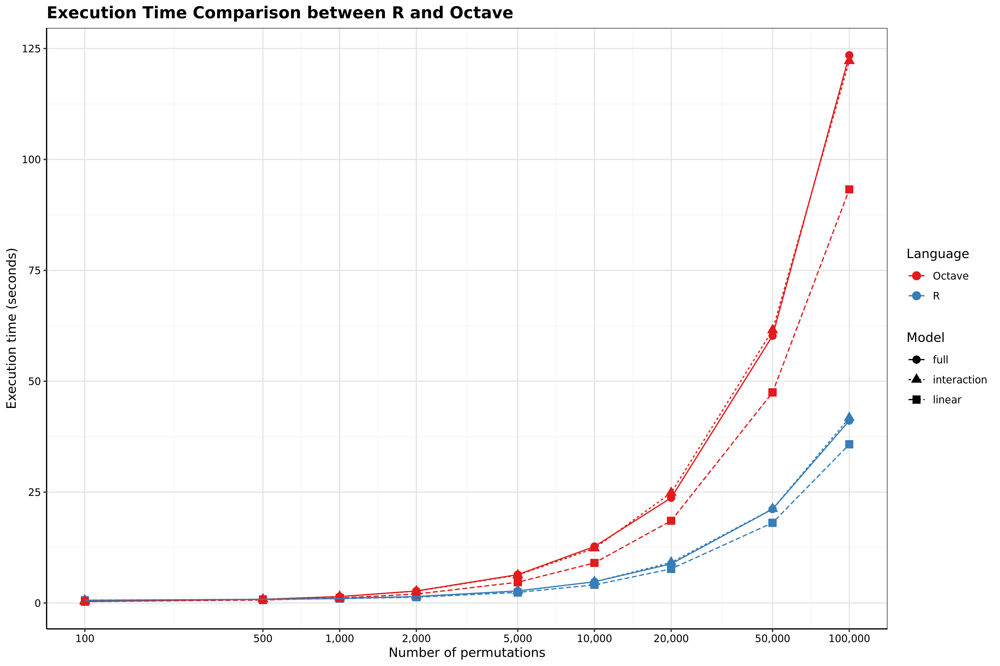
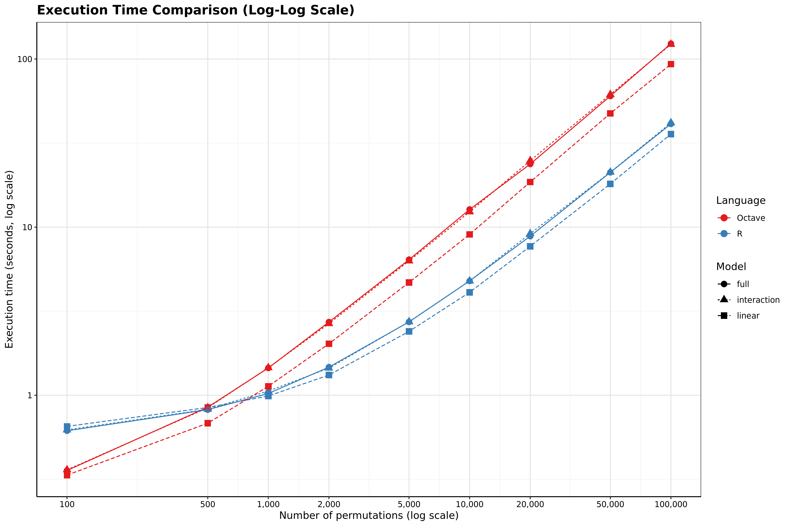
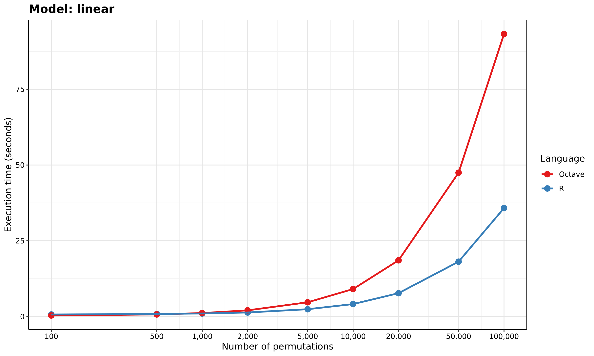
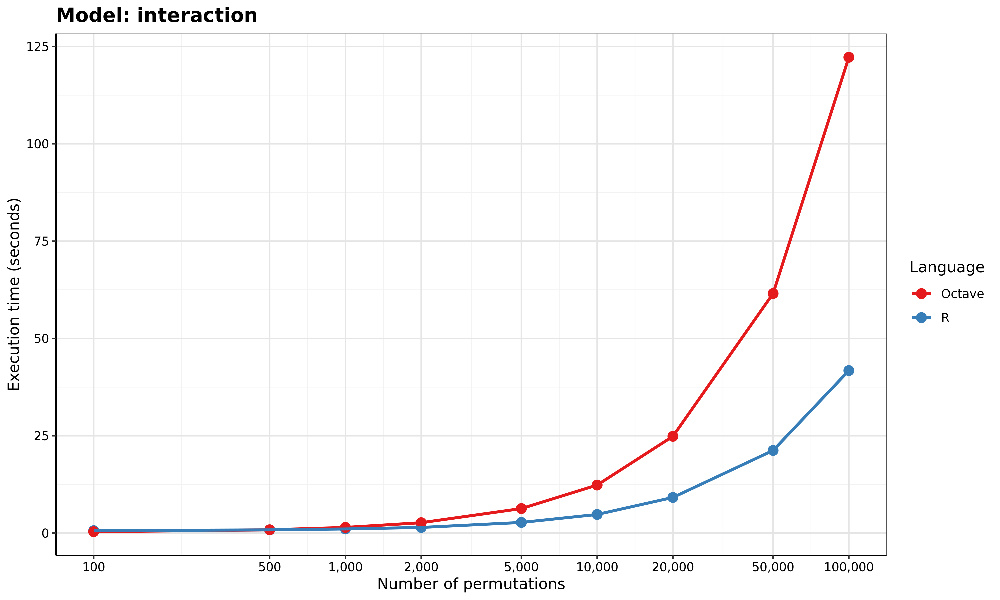
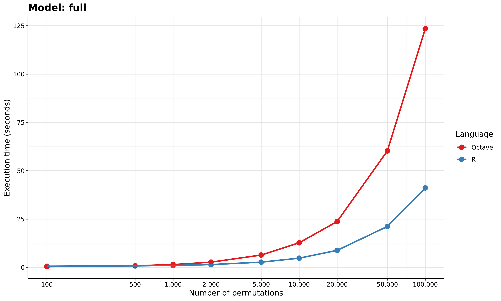
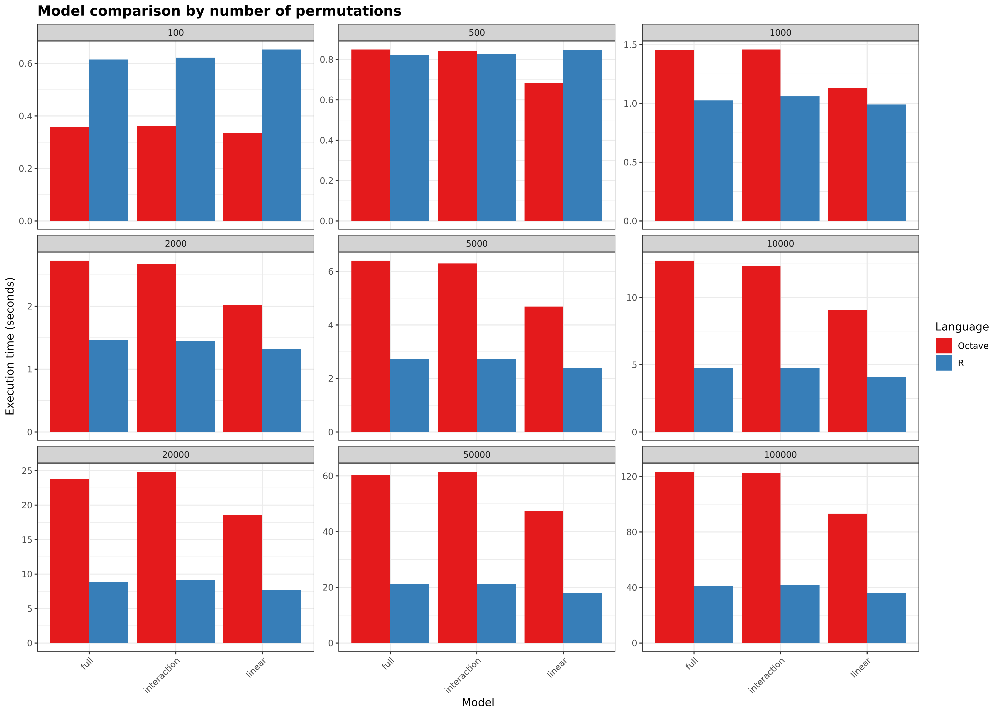
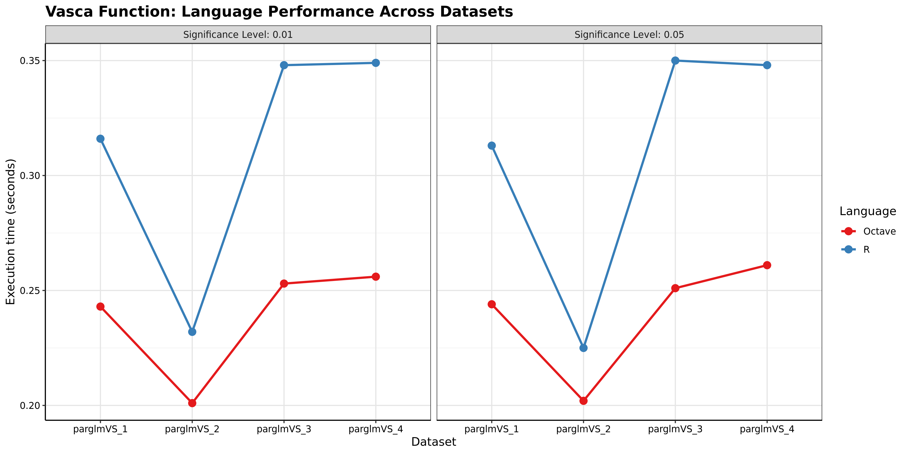
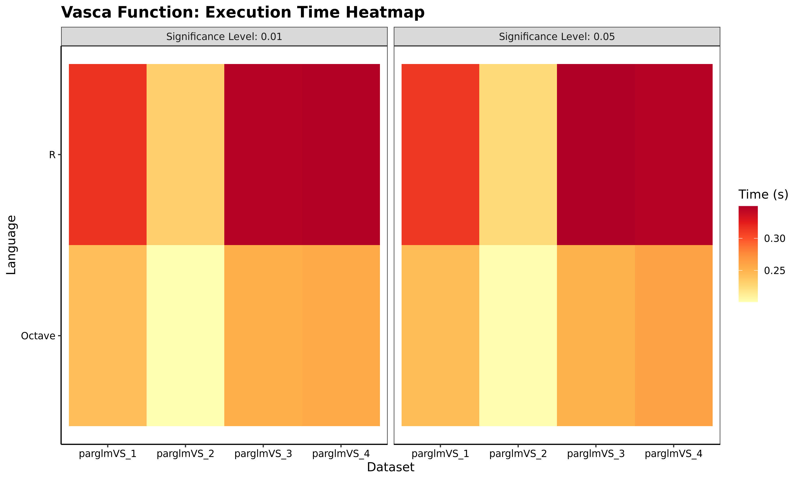
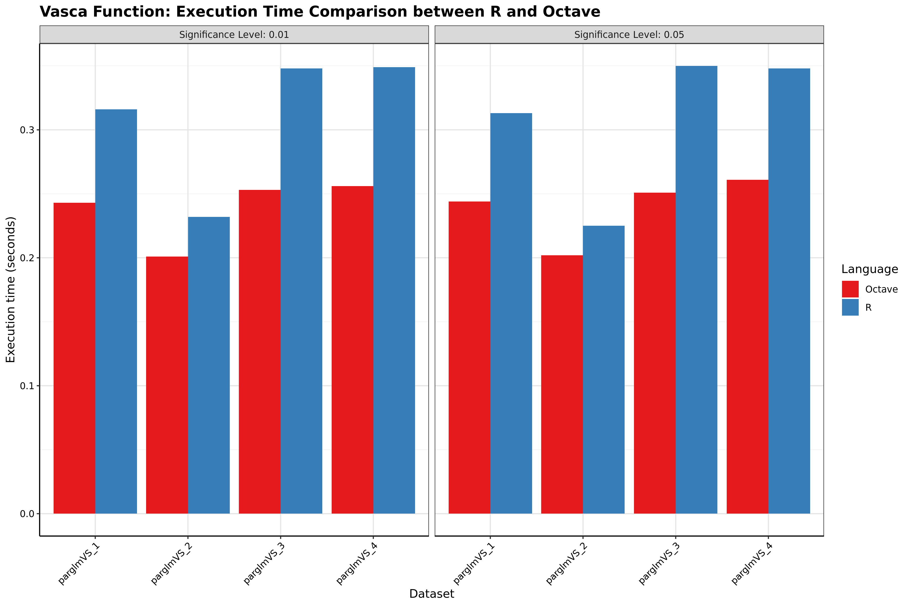

# vASCA-R - TFG Code Repository

## Table of Contents
- [vASCA-R - TFG Code Repository](#vasca-r---tfg-code-repository)
  - [Table of Contents](#table-of-contents)
  - [1. 🎓 Introduction](#1--introduction)
  - [2. 🧠 About VASCA](#2--about-vasca)
  - [3. 📁 Repository Structure](#3--repository-structure)
    - [3.1. Tests Directory Structure](#31-tests-directory-structure)
  - [4. 👷🏻 GitHub Workflows](#4--github-workflows)
  - [5. 🐳 Docker Image](#5--docker-image)
  - [6. 📝 Functions Description](#6--functions-description)
  - [7. Example Usage](#7-example-usage)
    - [7.1 MATLAB/Octave](#71-matlaboctave)
    - [7.2. R](#72-r)
  - [8. 📈 Performance Comparison](#8--performance-comparison)
    - [8.1. `parglmVS` Performance](#81-parglmvs-performance)
    - [8.2. `vasca` Performance](#82-vasca-performance) 

---

## 1. 🎓 Introduction

This repository contains the code developed for my Bachelor's Thesis (Trabajo de Fin de Grado, TFG), focused on the implementation, testing, and comparison of the VASCA algorithm in both MATLAB and R. The project also includes a Docker-based environment for reproducibility and a set of automated tests to ensure consistency across implementations.

The R implementation is a redesign of the original MATLAB code developed by my thesis advisor, José Camacho, available at [josecamachop/MEDA-Toolbox](https://github.com/josecamachop/MEDA-Toolbox). The R version maintains the same logic and structure, while adapting the code to R programming conventions and syntax.

## 2. 🧠 About VASCA

VASCA (Variable-selection ANOVA Simultaneous Component Analysis) is a statistical method designed for analyzing multivariate data obtained from designed experiments, especially when the number of measured variables is very large (e.g., omics data). It extends the popular ASCA method by incorporating variable selection into the multivariate testing framework, improving statistical power while controlling the Type-I error rate. Some VASCA advantages are:

- **Variable Selection**: VASCA automatically identifies the most relevant variables (e.g. biomarkers) contributing to an experimental effect, reducing noise and improving interpretability.
- **Multivariate Inference**: Unlike univariate methods, VASCA captures multivariate effects by modeling combinations of variables, which is especially useful in high-dimensional datasets.
- **Improved Statistical Power**: Thanks to its variable selection mechanism, VASCA can detect subtle effects that would be missed by traditional holistic multivariate tests.
- **Robust Permutation Testing**: The use of permutation-based inference makes VASCA non-parametric and robust against violations of normality assumptions
- **Exploratory Visualization**: VASCA integrates naturally with Principal Component Analysis (PCA), enabling intuitive score and loading plots to explore data structure and interpret results.
- **Flexible Design Handling**: It can be applied to complex experimental designs, including multiple factors and interactions, even in unbalanced settings.

It has been successfully applied to both simulated data and real-world multi-omic studies, showing excellent performance in identifying biologically meaningful patterns.

For more details about the method, you can refer to the official VASCA paper:  
*José Camacho, Raffaele Vitale, David Morales-Jiménez, Carolina Gómez-Llorente. Variable-selection ANOVA Simultaneous Component Analysis (VASCA), Bioinformatics, Volume 39, Issue 1, January 2023, btac795*.  
Available at: [https://doi.org/10.1093/bioinformatics/btac795](https://doi.org/10.1093/bioinformatics/btac795)

Alternatively, you can consult my Bachelor's Thesis report, which provides a more in-depth explanation of the algorithm and all related statistical concepts: [github.com/danieeeld2/TFG-LaTex](https://github.com/danieeeld2/TFG-LaTex)

## 3. 📁 Repository Structure

```bash
├── datasets/              # Input data and intermediate files (CSV, JSON)
├── matlab/                # MATLAB/Octave implementation of VASCA pipeline
├── R/                     # R implementation of VASCA pipeline
├── tests/                 # Go-based test suite comparing Octave and R results
├── Dockerfile             # Docker environment to run both R and Octave code
├── requirements.txt       # R dependencies for scripts and tests
├── LICENSE
└── README.md
```

The `matlab/` folder contains the implementation of all functions involved in the VASCA pipeline in MATLAB/Octave, as well as auxiliary functions required for certain calculations. This code was developed by José Camacho and can be found in his repository [josecamachop/MEDA-Toolbox](https://github.com/josecamachop/MEDA-Toolbox). These scripts are included in this repository with the purpose of testing the R implementation by comparing the outputs. On the other hand, the `R/` folder contains the implementation of all functions involved in the VASCA pipeline in R, as well as auxiliary functions required for certain calculations, implemented by Daniel Alconchel.

### 3.1. Tests Directory Structure

```bash
├── createDesign_runners/
├── createDesign_test.go
├── loadings_runners/
├── loadings_test.go
├── loadings_test_results/
├── parglmVS_benchmark/
├── parglmVS_benchmark.sh
├── parglmVS_runners/
├── parglmVS_test.go
├── pcaEig_runners/
├── pcaEig_test.go
├── plotScatter_runners/
├── plotScatter_test.go
├── plotScatter_test_results/
├── plotVec_runners/
├── plotVec_test.go
├── plotVec_test_results/
├── preprocess2D_runners/
├── preprocess2D_test.go
├── scores_runners/
├── scores_test.go
├── scores_test_results/
├── vasca_benchmark/
├── vasca_benchmark.sh
├── vasca_runners/
└── vasca_test.go
```

The `tests` folder contains the tests for each implemented function in Go. Since we have the original MATLAB implementation and the redesigned version in R, to test the code, we compare the output of the R scripts with the corresponding Octave scripts. Each function has its own test and a `<function_name>_runners/` folder, which contains an Octave script and an R script. These scripts are responsible for receiving the parameters from a terminal call, validating them, formatting them appropriately for each language, and passing them to the respective function (in its respective language). The results are then stored in a CSV, JSON, or image file (depending on the function) for output comparison.

In general, all functions return structures with numerical data that can be compared as matrices in the tests, except for `plotScatter`, `plotVec`, `scores`, and `loadings`. These functions return images, so their tests generate a folder with the execution results and a file named `RESULTS.md` for comparing the plots in both languages.

⚠️⚠️ *`parglmVS` is the function responsible for calculating all the data structures in the permutation test. These permutations are random, and for the test, we require a large number of permutations due to the fact that the random number generators in both languages are different. This results in the test taking a considerable amount of time, as discussed in the issues [#51](https://github.com/danieeeld2/vASCA-R/issues/51) and [#52](https://github.com/danieeeld2/vASCA-R/issues/52), as well as in the PR [#30](https://github.com/danieeeld2/vASCA-R/pull/30). At the end of this PR, you can find a screenshot showing the execution time of this test and confirming that the function passes the tests. If you want to reactivate it, simply go to the `parglmVS_test.go` code and comment the two lines that contain `t.Skip`.* 

In addition to the tests, we provide the scripts `vasca_benchmark.sh` and `parglmVS_benchmark.sh`, which generate comparative performance plots of the R and MATLAB/Octave implementations of these functions. The results are stored in the `<function>_benchmark/` folder. You can find more information about this benchmark in [Section 8](#8-📈-performance-comparison)

## 4. 👷🏻 GitHub Workflows

The repository includes two GitHub workflows: `docker.yml` and `test.yml`.

- `docker.yml` is an automation that, when a push is made to GitHub and changes are detected in the dependencies of any of the languages or the Dockerfile, it automatically rebuilds the image and uploads it to DockerHub under `danieeeld2/r-vasca-testing:latest`. *Please note that if you fork the repository, you will need to change the user access credentials (which are added as GitHub secrets) and the push target.*
  ```yml
    username: ${{ secrets.DOCKER_USERNAME }}
    password: ${{ secrets.DOCKERHUB_TOKEN }}
    ...
        tags: danieeeld2/r-vasca-testing:latest
    ```

- `test.yml` downloads the `danieeeld2/r-vasca-testing:latest` image and mounts a volume with the repository's content. This workflow automates the process of running the tests on every push to any branch.

## 5. 🐳 Docker Image

You can either download the Docker image from DockerHub using the following command:

```bash
docker pull danieeeld2/r-vasca-testing:latest
```

Alternatively, you can build the image yourself using the provided Dockerfile with the following command:

```bash
docker build -t danieeeld2/r-vasca-testing .
```

To mount a volume with the project from the root folder and run it interactively with `/bin/bash`, use the following command:

```bash
docker run -it --rm -v "$(pwd):/app" -w /app danieeeld2/r-vasca-testing:latest /bin/bash
```
With this, you have a ready-to-use environment with all the code, languages, and dependencies installed, prepared for you to start programming your own analyses.

⚠️⚠️ *If you check [issue #94](https://github.com/danieeeld2/vASCA-R/issues/94) and [Dockerfile](https://github.com/danieeeld2/vASCA-R/blob/main/Dockerfile), you’ll see that the Docker image tagged as `latest` does not come with the R dependencies preinstalled. As a result, when you run the scripts for the first time, the necessary R packages will be installed on-the-fly. This approach was taken because installing all dependencies directly during the image build process caused multiple version conflicts that broke the environment. If you'd rather use a version of the image with all R dependencies already installed (see [requirements.txt](https://github.com/danieeeld2/vASCA-R/blob/main/requirements.txt)), you can pull the image tagged as `r-dependencies-installed` instead of `latest`.*

## 6. 📝 Functions Description

- **createDesign**: Generates a balanced design matrix for experimental designs based on a list of factor levels and the number of replicates. The function creates all possible combinations of the factor levels and replicates the rows if needed.
- **loadings**: Computes and plots loadings based on a model, which includes latent variables, model parameters, and data scores. The function supports different plot types such as scatter and bar plots, and allows customization of labels, classes, blur effect, and colors for visualization.
- **okabe_ito_hex**: Generates a color palette with colorblind-friendly colors from the Okabe-Ito palette. It returns a specified number of hex color codes, repeating the palette if necessary to match the requested number of colors.
- **parglmVS**: Performs a parallelized generalized linear model (GLM) with permutation testing for variable selection. It evaluates the significance of variables and allows customization of preprocessing, statistical tests, and correction for multiple comparisons.
- **pcaEig**: Performs Principal Component Analysis (PCA) using eigen decomposition on a preprocessed bilinear dataset. The function returns the total variance, latent variables, loadings (eigenvectors), scores (transformed data), and the analysis type.
- **plotScatter**: Creates a scatter plot for visualizing the relationship between two variables. The function allows customization of axis labels, titles, color schemes, and the addition of regression lines or trend lines, offering flexibility in the presentation of the data.
- **plotVec**: Creates bar or line plots for vectors with optional grouping, labels, and control limits. The function allows customization of plot type, color palettes, axis labels, and more, providing flexible visualization options for high-dimensional data.
- **preprocess2D**: Preprocesses 2D data using methods like mean centering, auto-scaling, or Pareto scaling. The function can also apply weights to the data after preprocessing. It returns the preprocessed data along with the sample averages and scales.
- **scores**: Computes and visualizes the scores of a model, either through bar plots or scatter plots. It can handle both calibration and test data, and allows customization of plot appearance. The function supports multiple plot types, including scatter and bar plots, with options for label density, classes, and color customization.
- **text_scatter_ggplot**: Creates a scatter plot with labels using ggplot2, with customizable options for plot appearance, label density, and point size/shape. The function uses the `ggrepel` package to avoid overlapping labels and supports various plot configurations such as multiplicity-based size, shape, and color.
- **vasca**: Performs Variable-selection ANOVA Simultaneous Component Analysis (VASCA) for analyzing multivariate data from designed experiments. The function performs PCA on factors and interactions based on significance level or number of variables selected, and computes the scores, loadings, singular values, and projections of factors and interactions. It also handles matrix extraction, data preprocessing, and robust conversion of data structures. The function returns a list containing the results of the analysis.

## 7. Example Usage

We will provide an example of an execution pipeline in each language, using the Docker image `danieeeld2/r-vasca-testing:latest` (or `danieeeld2/r-vasca-testing:r-dependencies-installed` if you want to have already installed R dependencies) and running everything from the root directory of the project. Start by running the image with a volume that includes the project, as instructed in [Section 5](#5-🐳-docker-image).

```bash
docker run -it --rm -v "$(pwd):/app" -w /app danieeeld2/r-vasca-testing:latest /bin/bash
```

### 7.1 MATLAB/Octave

```matlab
% Add path to matlab scripts
addpath('./matlab');

% Read a bilinear dataset for model fitting and design matrix
if exist('OCTAVE_VERSION', 'builtin') ~= 0
    % If running in Octave, use csvread
    X = csvread('./datasets/tests_datasets/X_test.csv');
    F = csvread('./datasets/tests_datasets/F_test.csv');
else
    % If running in MATLAB, use readmatrix
    X = readmatrix('./datasets/tests_datasets/X_test.csv');
    F = readmatrix('./datasets/tests_datasets/F_test.csv');
end

% Call parglmVS to obtain multivariate factor and interaction matrices
[TVS, parglmoVS] = parglmVS(X, F, 'Model', 'full', 'Permutations', 50000);
disp(TVS);

% Call vasca to obtain the structure with scores, loadings, singular values and projections of factors/interactions
vascao = vasca(parglmoVS, 0.25); % (I am using a significance level of 0.25 for finding significant factors for the example)
disp(vascao);

% Generate loadings and scores plots
% Iterate over all factors
for i = 1:vascao.nFactors
    if vascao.factors(i).stasig  % Only process significant factors
        fprintf('Factor %d (Significant)\n', i);
        
        % --- Prepare model structure for PLOTTING ---
        tempModel = struct();
        
        % Required for LOADINGS()
        tempModel.loads = vascao.factors(i).loadsSorted;  % or .loads
        tempModel.scores = vascao.factors(i).scoresV;     % Scores
        tempModel.lvs = 1:size(tempModel.loads, 2);       % LVs (e.g., 1:2 for PC1 & PC2)
        
        % Required for SCORES()
        tempModel.var = sum(var(vascao.factors(i).scoresV)); % Approx. total variance
        % (Optional: Add 'av' and 'sc' if preprocessing was applied)
        
        % --- Generate PLOTS ---
        % 1. Plot LOADINGS
        figLoadings = loadings(tempModel, ...
            'Title', sprintf('Factor %d Loadings', i), ...
            'PlotType', 'Scatter');  % or 'Bars'
        
        % 2. Plot SCORES
        figScores = scores(tempModel, ...
            'Title', sprintf('Factor %d Scores', i), ...
            'PlotType', 'Scatter', ...
            'ObsClass', vascao.design(:, i)); 
        
    else
        fprintf('Skipping Factor %d (Not significant, stasig = %d)\n', i, vascao.factors(i).stasig);
    end
end
```

### 7.2. R

```R
# Add all R scripts in the R directory to the search path
files <- list.files(path = "./R", pattern = "\\.R$", full.names = TRUE)
lapply(files, source)

# Clear console because the output of the imported functions is too long
cat("\014")  # Using form feed (your current approach)
# OR
if(interactive()) try(system("clear"), silent=TRUE)  # For Linux/macOS in interactive sessions
# OR
if(.Platform$OS.type == "windows") {
  try(system("cls"), silent=TRUE)  # For Windows
} else {
  try(system("clear"), silent=TRUE)  # For Unix-like
}

# Read a bilinear dataset for model fitting and design matrix
X <- as.matrix(read.csv("./datasets/tests_datasets/X_test.csv", header = FALSE))
F <- as.matrix(read.csv("./datasets/tests_datasets/F_test.csv", header = FALSE))

# Call parglmVS to obtain multivariate factor and interaction matrices
res_vs <- parglmVS(X, F, model = "full", permutations = 50000)
TVS <- res_vs[[1]]
parglmoVS <- res_vs[[2]]
print(TVS)
print(parglmoVS)

# Call vasca to obtain the structure with scores, loadings, singular values and projections of factors/interactions
vascao <- vasca(parglmoVS, siglev=0.25) # (I am using a significance level of 0.25 for finding significant factors for the example)
print(vascao)

# # Generate loadings and scores plots
# # Iterate over all factors
for (i in seq_len(vascao$nFactors)) {
  factor <- vascao$factors[[i]]

  if (factor$stasig) {  # Only process significant factors
    cat(sprintf("Factor %d (Significant)\n", i))

    # --- Prepare model structure for PLOTTING ---
    tempModel <- list()
    tempModel$loads <- as.matrix(factor$loadsSorted)  # or $loads
    tempModel$scores <- as.matrix(factor$scoresV)     # Scores
    tempModel$lvs <- seq_len(ncol(tempModel$loads))  # LVs (e.g., 1:2 for PC1 & PC2)
    tempModel$var <- sum(apply(factor$scoresV, 2, var)) # Approx. total variance

    # --- Generate PLOTS ---
    # 1. Plot LOADINGS
    figLoadings <- loadings(tempModel,
                            tit = sprintf("Factor %d Loadings", i),
                            plottype = "scatter")  # or "bars"

    # 2. Plot SCORES
    figScores <- scores(tempModel,
                    tit = sprintf("Factor %d Scores", i),
                    plottype = "scatter",
                    classes = vascao$design[, i])
  } else {
    cat(sprintf("Skipping Factor %d (Not significant, stasig = %d)\n", i, factor$stasig))
  }
}
```

## 8. 📈 Performance Comparison

In this repository, we have implemented several functions to carry out the VASCA pipeline in R. However, to evaluate the performance of the R implementation compared to its MATLAB/Octave counterpart, we focus on the two main scripts that form the core of the pipeline: `parglmVS` and `vasca`.

### 8.1. `parglmVS` Performance

The script `tests/parglmVS_benchmark.sh` automates the benchmarking process for the `parglmVS` function implemented in both R and MATLAB/Octave. It runs the function across multiple models (`linear`, `interaction`, and `full`) and a range of permutation values, measuring execution times for each configuration. The results are saved in a CSV file and visualized using several comparative plots, which are generated automatically with R and stored in the `parglmVS_benchmark/` folder. *The datasets used are `X_DATA="../datasets/tests_datasets/X_test.csv"` and `F_DATA="../datasets/tests_datasets/F_test.csv"`*.

<p align="center">
  
  
</p>

<p align="center"><i>
Comparison of execution times between R and Octave for the <code>parglmVS</code> function. The left plot shows the raw execution times across different models and number of permutations, while the right plot displays the same results using a log-log scale for better visualization of performance differences at large scales.
</i></p>

<p align="center">
  
  
  
</p>

<p align="center"><i>
Execution time comparisons for the <code>parglmVS</code> function between R and Octave, separated by model type. Each plot shows how performance varies with the number of permutations for the linear, interaction, and full models, respectively.
</i></p>

<p align="center">
  
</p>

<p align="center"><i>
Bar chart summarizing the execution times of the <code>parglmVS</code> function across different models and permutation counts, grouped by language (R vs. Octave). This visualization helps highlight relative performance differences depending on model complexity and computational load.
</i></p>

As observed in the benchmark plots, the R implementation significantly outperforms the Octave version when computing the test structures for permutation testing across all three model types. This performance gap becomes increasingly pronounced as the number of permutations grows, highlighting the efficiency of the R-based approach in handling larger computational loads.

### 8.2. `vasca` Performance

The script `tests/vasca_benchmark.sh` automates the benchmarking process for the `vasca` function in both R and MATLAB/Octave. It evaluates performance across multiple datasets and two significance levels (`0.01` and `0.05`), measuring execution times for each configuration. The results are compiled into a CSV file and visualized through a variety of comparative plots, automatically generated with R and saved in the `vasca_benchmark/` directory. *The datasets used for this benchmark are four `.json` files located under `../datasets/tests_datasets/`, named `parglmVS_1.json` to `parglmVS_4.json`.*

<p align="center">
  
  
</p>

<p align="center">
  <em>The first image compares the execution time of the <code>vasca</code> function between R and Octave across different datasets and significance levels. Each point represents an individual execution time, with lines connecting the results for each language. The second image shows a heatmap visualizing the execution times of the <code>vasca</code> function, categorized by language and dataset, at various significance levels.</em>
</p>

<p align="center">
  
</p>

<p align="center">
  <em>Comparison of the execution time of the <code>vasca</code> function in R and Octave across four datasets, with bars grouped by significance level (0.01 and 0.05).</em>
</p>

Although the performance of Octave/MATLAB is better in this case, the `vasca` function requires significantly less computational time compared to `parglmVS`. The performance differences between Octave and R are not as pronounced in this case, but when considering the entire pipeline, R will offer better overall performance. This is because the `parglmVS` function, which is the most computationally intensive part of the pipeline, is much more optimized in R, resulting in a faster overall execution when running the entire workflow in R.


