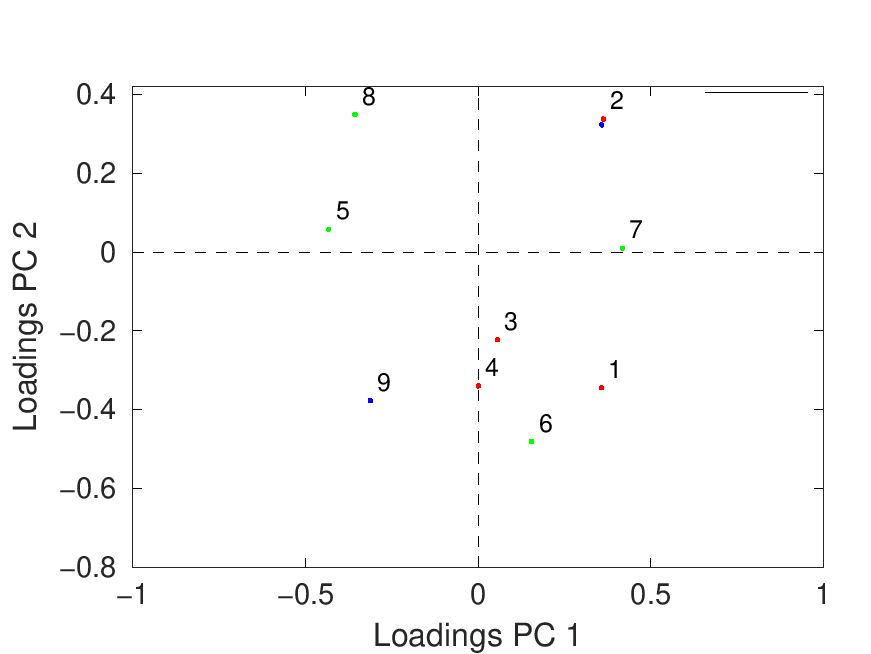
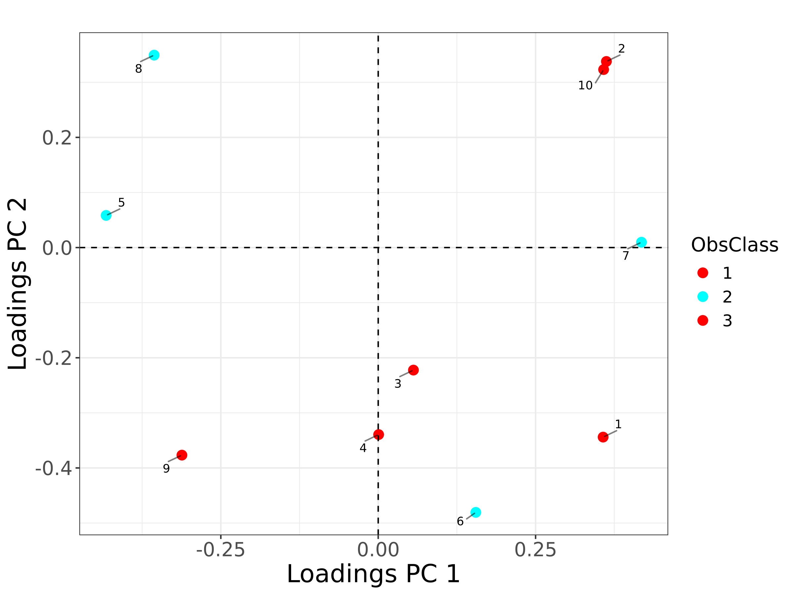

# Loadings Plot Comparison: MATLAB vs R

**Generated at**: 2025-04-07 14:55:17  
**Test Results**  

## loadings with classes

**Dataset**: model_2.json

| MATLAB | R |
|--------|---|
|  |  |

### Commands
```bash
# R Command
Rscript ./loadings_runners/loadings_run.R ../datasets/tests_datasets/model_2.json classes c(1,1,1,1,2,2,2,2,3,3) Color hsv

# MATLAB Command
octave --no-gui -q ./loadings_runners/loadings_run.m ../datasets/tests_datasets/model_2.json VarsClass [1;1;1;1;2;2;2;2;3;3] Color 'hsv'
```

---

