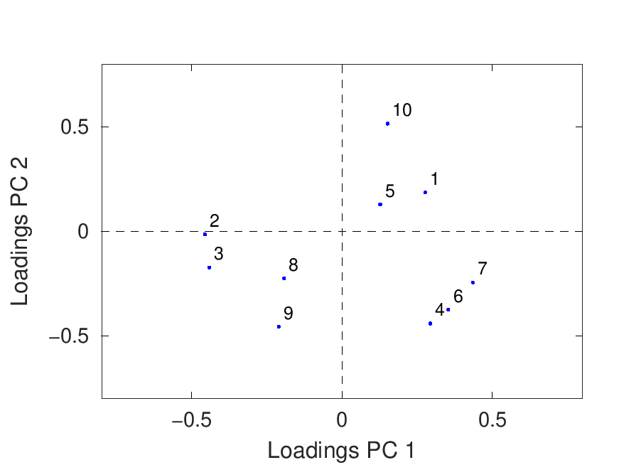
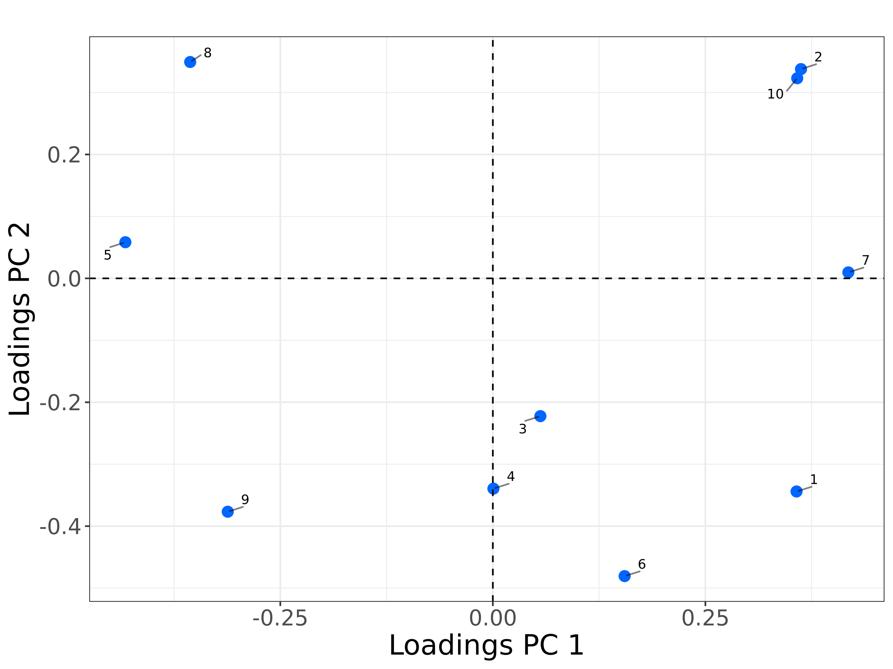
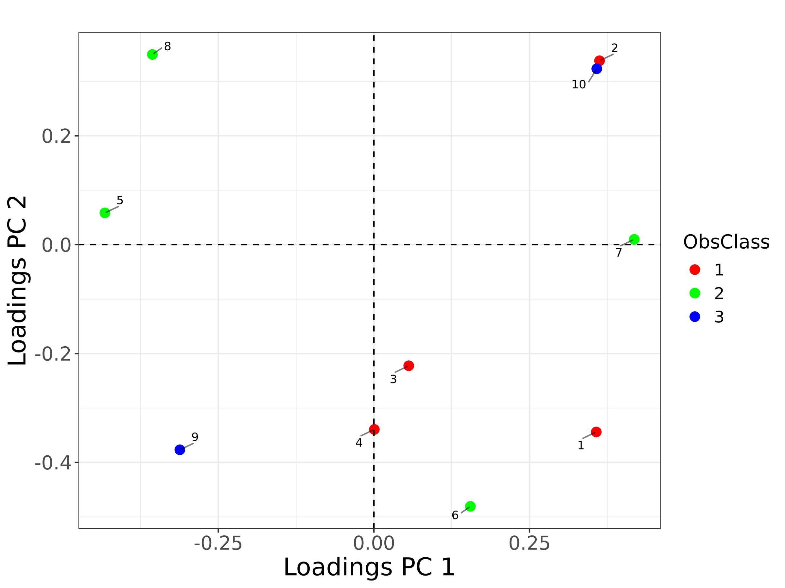

# Loadings Plot Comparison: MATLAB vs R

**Generated at**: 2025-04-07 15:20:56  
**Test Results**  

## basic loadings

**Dataset**: model_1.json

| MATLAB | R |
|--------|---|
|  |  |

### Commands
```bash
# R Command
Rscript ./loadings_runners/loadings_run.R ../datasets/tests_datasets/model_1.json

# MATLAB Command
octave --no-gui -q ./loadings_runners/loadings_run.m ../datasets/tests_datasets/model_1.json
```

---

## loadings with scatter plot

**Dataset**: model_2.json

| MATLAB | R |
|--------|---|
|  |  |

### Commands
```bash
# R Command
Rscript ./loadings_runners/loadings_run.R ../datasets/tests_datasets/model_2.json PlotType Scatter

# MATLAB Command
octave --no-gui -q ./loadings_runners/loadings_run.m ../datasets/tests_datasets/model_2.json PlotType Scatter
```

---

## loadings with bar plot

**Dataset**: model_3.json

| MATLAB | R |
|--------|---|
|  |  |
|  |  |

### Commands
```bash
# R Command
Rscript ./loadings_runners/loadings_run.R ../datasets/tests_datasets/model_3.json PlotType Bars

# MATLAB Command
octave --no-gui -q ./loadings_runners/loadings_run.m ../datasets/tests_datasets/model_3.json PlotType Bars
```

---

## loadings with custom labels

**Dataset**: model_1.json

| MATLAB | R |
|--------|---|
|  |  |

### Commands
```bash
# R Command
Rscript ./loadings_runners/loadings_run.R ../datasets/tests_datasets/model_1.json VarsLabel c('Var1','Var2','Var3','Var4','Var5','Var6','Var7','Var8','Var9','Var10') Title Custom Labels

# MATLAB Command
octave --no-gui -q ./loadings_runners/loadings_run.m ../datasets/tests_datasets/model_1.json VarsLabel {'Var1';'Var2';'Var3';'Var4';'Var5';'Var6';'Var7';'Var8';'Var9';'Var10'} Title 'Custom Labels'
```

---

## loadings with classes

**Dataset**: model_2.json

| MATLAB | R |
|--------|---|
|  |  |

### Commands
```bash
# R Command
Rscript ./loadings_runners/loadings_run.R ../datasets/tests_datasets/model_2.json classes c(1,1,1,1,2,2,2,2,3,3) Color hsv

# MATLAB Command
octave --no-gui -q ./loadings_runners/loadings_run.m ../datasets/tests_datasets/model_2.json VarsClass [1;1;1;1;2;2;2;2;3;3] Color 'hsv'
```

---

