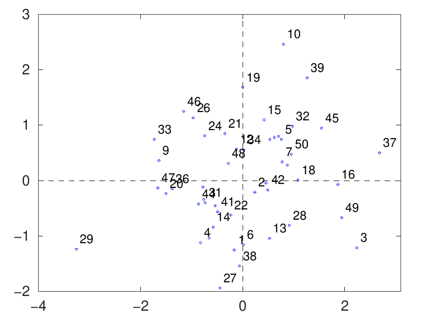
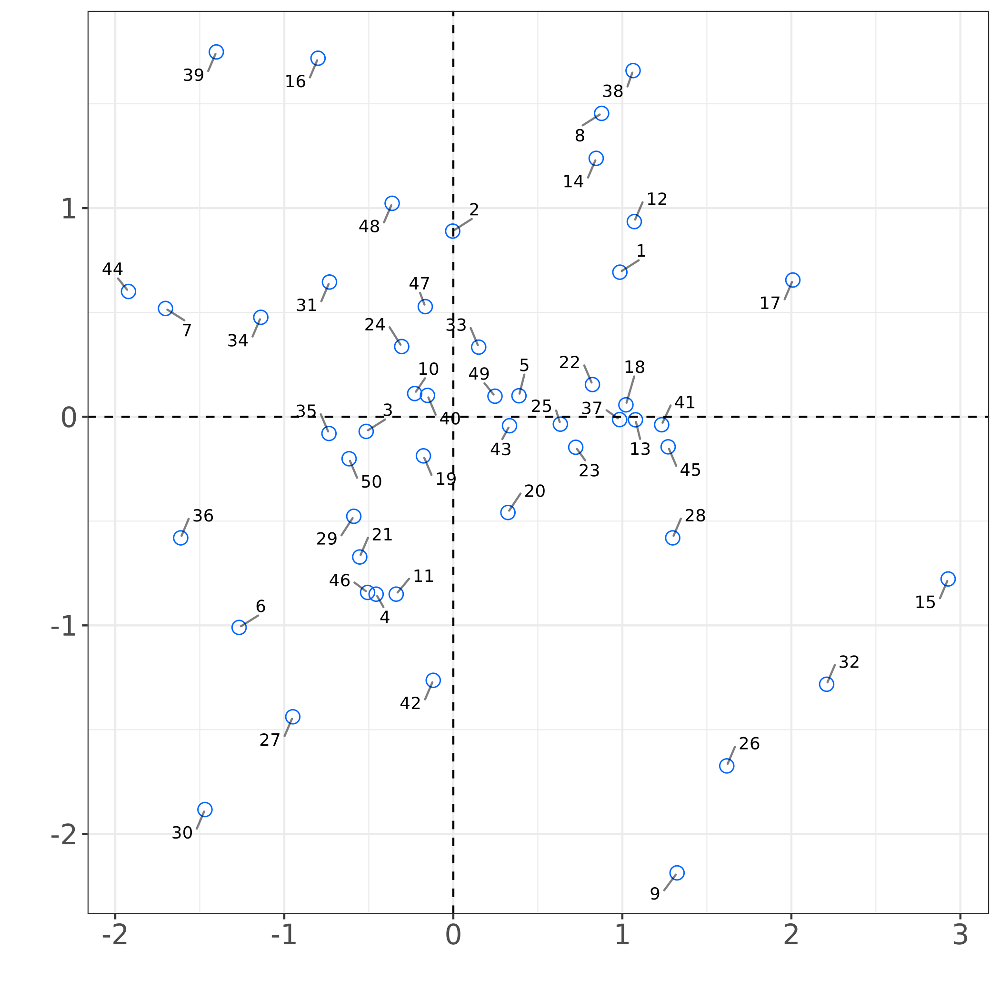
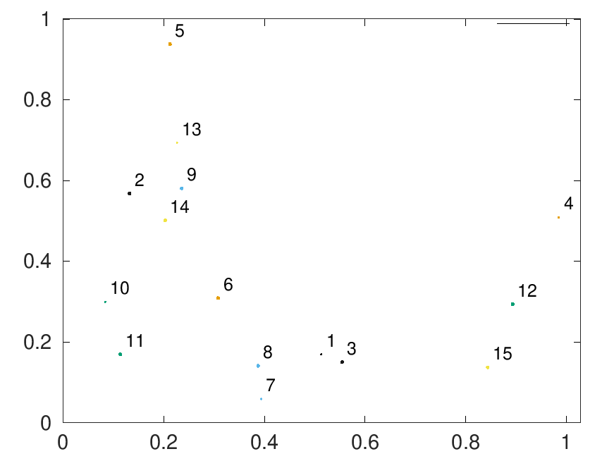
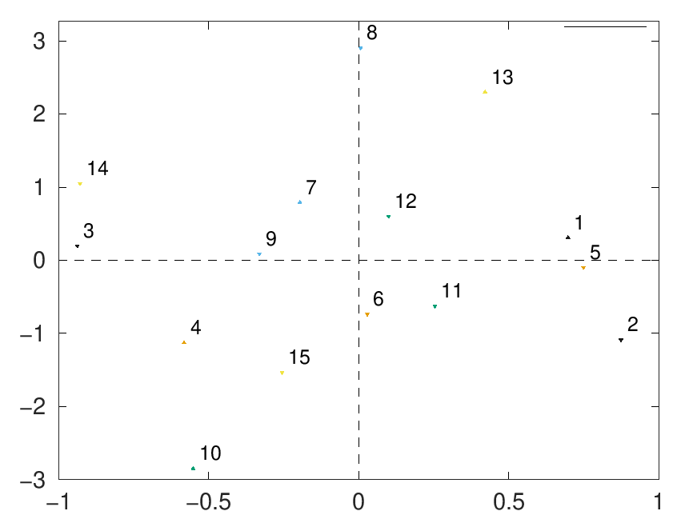
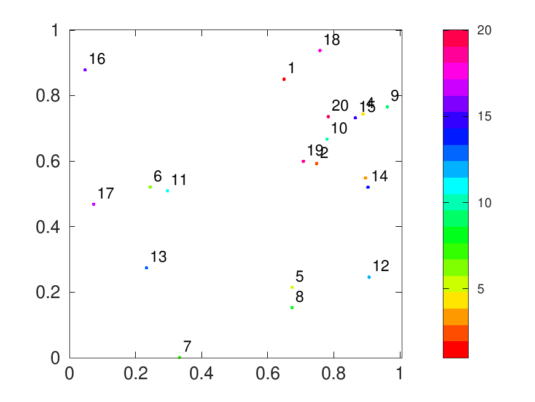
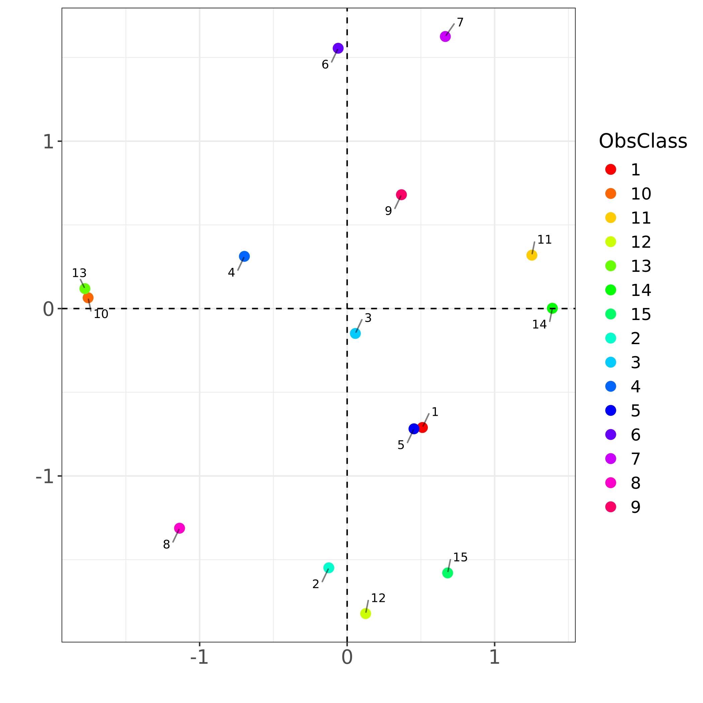

# Scatter Plot Comparison: MATLAB vs R

**Generated at**: 2025-04-04 08:44:08  
**Test Results**  

## basic_random_data

| MATLAB | R |
|--------|---|
|  |  |

### Commands
```bash
# R Command
Rscript ./plotScatter_runners/plotScatter_run.R cbind(runif(100), runif(100))

# MATLAB Command
octave --no-gui -q ./plotScatter_runners/plotScatter_run.m [rand(100,1), rand(100,1)]
```

---

## with_labels_and_classes

| MATLAB | R |
|--------|---|
|  |  |

### Commands
```bash
# R Command
Rscript ./plotScatter_runners/plotScatter_run.R cbind(rnorm(5), rnorm(5)) EleLabel c('A','B','C','D','E') ObsClass c(1,1,2,2,3) XYLabel c('X-axis','Y-axis')

# MATLAB Command
octave --no-gui -q ./plotScatter_runners/plotScatter_run.m rand(5,2) EleLabel ['A';'B';'C';'D';'E'] ObsClass [1;1;2;2;3] XYLabel ['X-axis';'Y-axis']
```

---

## filled_markers

| MATLAB | R |
|--------|---|
|  |  |

### Commands
```bash
# R Command
Rscript ./plotScatter_runners/plotScatter_run.R cbind(rnorm(50), rnorm(50)) FilledMarkers true

# MATLAB Command
octave --no-gui -q ./plotScatter_runners/plotScatter_run.m randn(50,2) FilledMarkers true
```

---

## multiplicity_size

| MATLAB | R |
|--------|---|
|  |  |

### Commands
```bash
# R Command
Rscript ./plotScatter_runners/plotScatter_run.R cbind(runif(15), runif(15)) FilledMarkers TRUE ObsClass c(1,1,1,2,2,2,3,3,3,4,4,4,5,5,5) Multiplicity c(1,5,10,1,5,10,1,5,10,1,5,10,1,5,10) PlotMult size

# MATLAB Command
octave --no-gui -q ./plotScatter_runners/plotScatter_run.m rand(15,2) FilledMarkers true ObsClass [1;1;1;2;2;2;3;3;3;4;4;4;5;5;5] Multiplicity [1;5;10;1;5;10;1;5;10;1;5;10;1;5;10] PlotMult 'size'
```

---

## multiplicity_shape

| MATLAB | R |
|--------|---|
|  |  |

### Commands
```bash
# R Command
Rscript ./plotScatter_runners/plotScatter_run.R cbind(rnorm(15), rnorm(15)) FilledMarkers TRUE ObsClass c(1,1,1,2,2,2,3,3,3,4,4,4,5,5,5) Multiplicity c(1,5,10,1,5,10,1,5,10,1,5,10,1,5,10) PlotMult shape

# MATLAB Command
octave --no-gui -q ./plotScatter_runners/plotScatter_run.m randn(15,2) FilledMarkers true ObsClass [1;1;1;2;2;2;3;3;3;4;4;4;5;5;5] Multiplicity [1;5;10;1;5;10;1;5;10;1;5;10;1;5;10] PlotMult 'shape'
```

---

## numerical_classes

| MATLAB | R |
|--------|---|
|  |  |

### Commands
```bash
# R Command
Rscript ./plotScatter_runners/plotScatter_run.R cbind(runif(20), runif(20)) ClassType Numerical ObsClass c(1:20) Color hsv

# MATLAB Command
octave --no-gui -q ./plotScatter_runners/plotScatter_run.m rand(20,2) ClassType 'Numerical' ObsClass (1:20)' Color 'hsv'
```

---

## categorical_classes

| MATLAB | R |
|--------|---|
|  |  |

### Commands
```bash
# R Command
Rscript ./plotScatter_runners/plotScatter_run.R cbind(rnorm(15), rnorm(15)) ClassType Categorical ObsClass c(1:15) Color hsv

# MATLAB Command
octave --no-gui -q ./plotScatter_runners/plotScatter_run.m randn(15,2) ClassType 'Categorical' ObsClass (1:15)' Color 'hsv'
```

---

