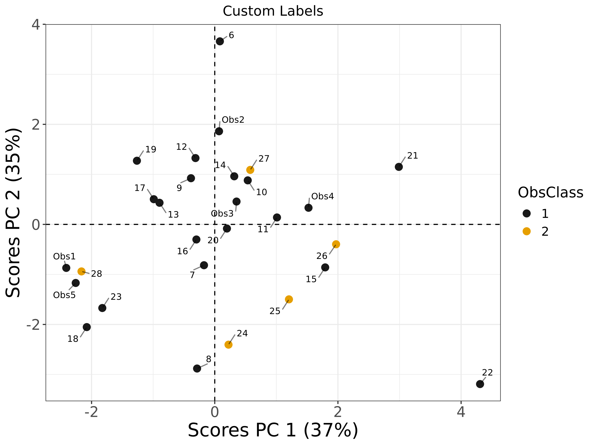

# Scores Plot Comparison: MATLAB vs R

**Generated at**: 2025-04-08 10:57:18  
**Test Results**  

## scores with custom labels

**Dataset**: scores_model_2.json

| MATLAB | R |
|--------|---|
|  |  |

### Commands
```bash
# R Command
Rscript ./scores_runners/scores_run.R ../datasets/tests_datasets/scores_model_2.json ObsLabel c('Obs1','Obs2','Obs3','Obs4','Obs5', as.character(6:28)) Title Custom Labels

# MATLAB Command
octave --no-gui -q ./scores_runners/scores_run.m ../datasets/tests_datasets/scores_model_2.json ObsLabel {'Obs1';'Obs2';'Obs3';'Obs4';'Obs5';'6';'7';'8';'9';'10';'11';'12';'13';'14';'15';'16';'17';'18';'19';'20';'21';'22';'23';'24';'25';'26';'27';'28'} Title 'Custom Labels'
```

---

