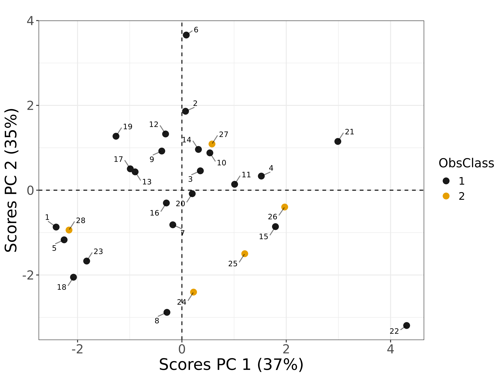
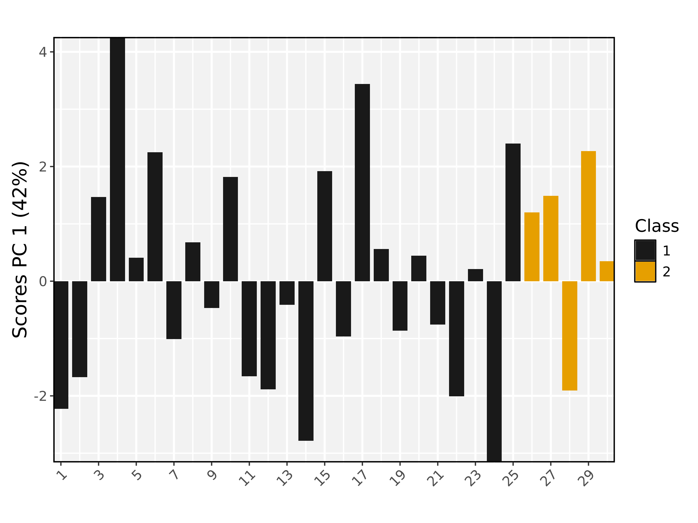
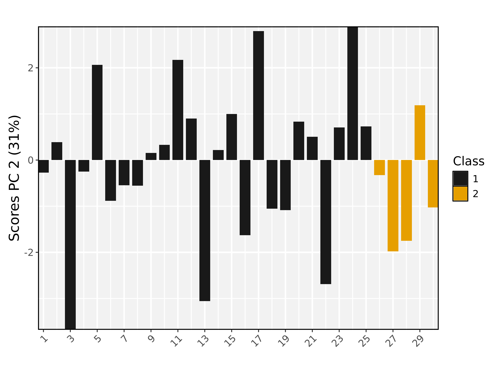
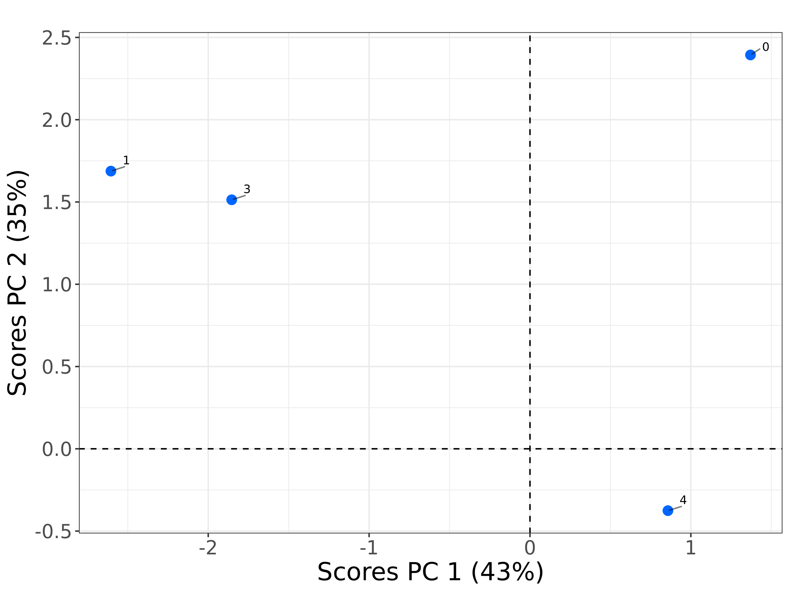
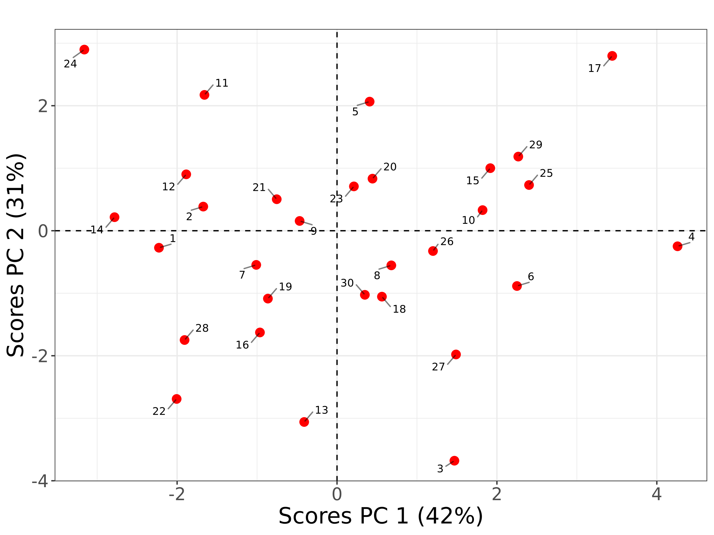
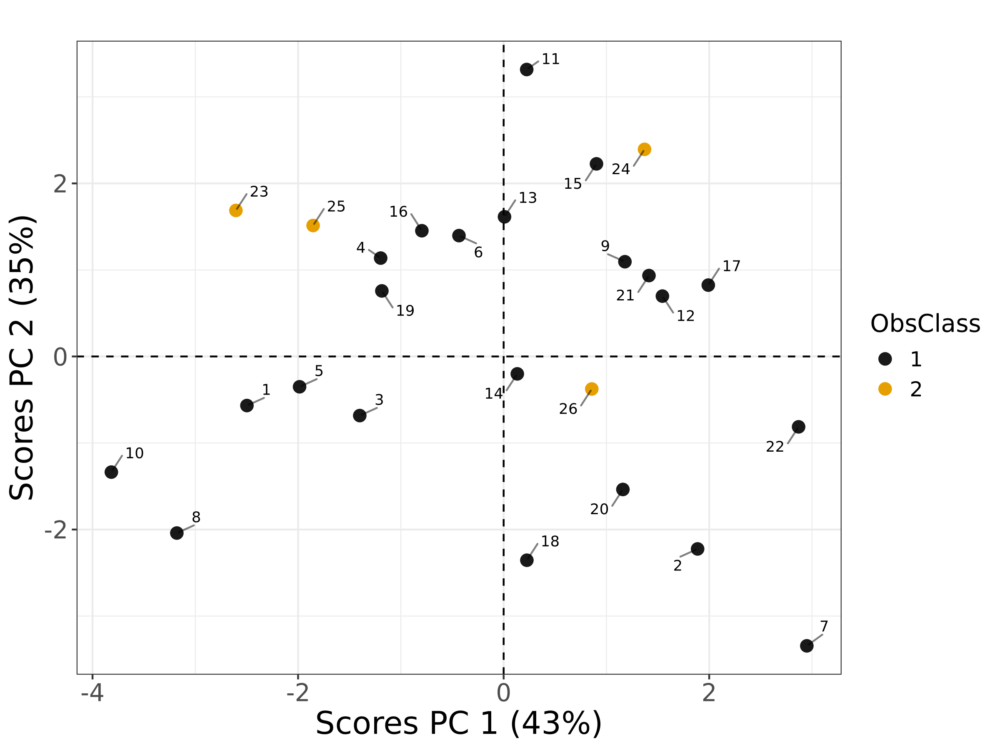

# Scores Plot Comparison: MATLAB vs R

**Generated at**: 2025-04-09 14:17:51  
**Test Results**  

## scores with basic scores

**Dataset**: scores_model_1.json

| MATLAB | R |
|--------|---|
|  |  |

### Commands
```bash
# R Command
Rscript ./scores_runners/scores_run.R ../datasets/tests_datasets/scores_model_1.json

# MATLAB Command
octave --no-gui -q ./scores_runners/scores_run.m ../datasets/tests_datasets/scores_model_1.json
```

---

## scores with scatter plot

**Dataset**: scores_model_2.json

| MATLAB | R |
|--------|---|
|  |  |

### Commands
```bash
# R Command
Rscript ./scores_runners/scores_run.R ../datasets/tests_datasets/scores_model_2.json PlotType Scatter

# MATLAB Command
octave --no-gui -q ./scores_runners/scores_run.m ../datasets/tests_datasets/scores_model_2.json PlotType Scatter
```

---

## scores with bar plot

**Dataset**: scores_model_3.json

| MATLAB | R |
|--------|---|
|  |  |
|  |  |

### Commands
```bash
# R Command
Rscript ./scores_runners/scores_run.R ../datasets/tests_datasets/scores_model_3.json PlotType Bars

# MATLAB Command
octave --no-gui -q ./scores_runners/scores_run.m ../datasets/tests_datasets/scores_model_3.json PlotType Bars
```

---

## scores with plotcal=FALSE and model-embedded test data

**Dataset**: scores_model_1.json

| MATLAB | R |
|--------|---|
|  |  |

### Commands
```bash
# R Command
Rscript ./scores_runners/scores_run.R ../datasets/tests_datasets/scores_model_1.json PlotCal FALSE

# MATLAB Command
octave --no-gui -q ./scores_runners/scores_run.m ../datasets/tests_datasets/scores_model_1.json PlotCal false
```

---

## scores with custom labels

**Dataset**: scores_model_2.json

| MATLAB | R |
|--------|---|
|  |  |

### Commands
```bash
# R Command
Rscript ./scores_runners/scores_run.R ../datasets/tests_datasets/scores_model_2.json ObsLabel c('Obs1','Obs2','Obs3','Obs4','Obs5', as.character(6:28)) Title Custom Labels

# MATLAB Command
octave --no-gui -q ./scores_runners/scores_run.m ../datasets/tests_datasets/scores_model_2.json ObsLabel {'Obs1';'Obs2';'Obs3';'Obs4';'Obs5';'6';'7';'8';'9';'10';'11';'12';'13';'14';'15';'16';'17';'18';'19';'20';'21';'22';'23';'24';'25';'26';'27';'28'} Title 'Custom Labels'
```

---

## scores with classes

**Dataset**: scores_model_3.json

| MATLAB | R |
|--------|---|
|  |  |

### Commands
```bash
# R Command
Rscript ./scores_runners/scores_run.R ../datasets/tests_datasets/scores_model_3.json ObsClass rep(c(1,1,2,2,3,3), length.out=30) Color hsv

# MATLAB Command
octave --no-gui -q ./scores_runners/scores_run.m ../datasets/tests_datasets/scores_model_3.json ObsClass repmat([1;1;2;2;3;3], ceil(30/6), 1)(1:30) Color 'hsv'
```

---

## scores with blur control

**Dataset**: scores_model_1.json

| MATLAB | R |
|--------|---|
|  |  |

### Commands
```bash
# R Command
Rscript ./scores_runners/scores_run.R ../datasets/tests_datasets/scores_model_1.json BlurIndex 0.5

# MATLAB Command
octave --no-gui -q ./scores_runners/scores_run.m ../datasets/tests_datasets/scores_model_1.json BlurIndex 0.5
```

---

## scores with explicit classes and color

**Dataset**: scores_model_3.json

| MATLAB | R |
|--------|---|
|  |  |

### Commands
```bash
# R Command
Rscript ./scores_runners/scores_run.R ../datasets/tests_datasets/scores_model_3.json ObsClass rep(c(1,1,2,2,3,3), length.out=30) Color hsv

# MATLAB Command
octave --no-gui -q ./scores_runners/scores_run.m ../datasets/tests_datasets/scores_model_3.json ObsClass repmat([1;1;2;2;3;3], ceil(30/6), 1)(1:30) Color 'hsv'
```

---

